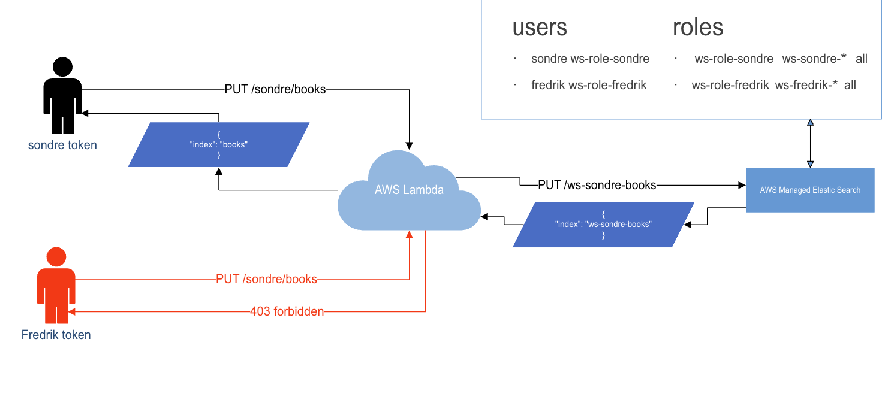

# search-workspace-service

## OpenSearch UI dashboard

The template creates an OpenSearch UI application (`AWS::OpenSearchService::Application`) with the OpenSearch domain as its data source.
The application name is set by the `DashboardApplicationName` template parameter, which the master pipeline stack in `search-workspace-service-infrastructure` passes in per environment.
Dashboard admin access is granted to all IAM principals that can access the application (`opensearchDashboards.dashboardAdmin.users: "*"`).

Workspaces and dashboards are content inside the application, not AWS resources.
There is no CloudFormation or AWS API support for them, so they are set up manually after the first deployment to a new environment:

1. Open the application endpoint (found in the AWS console under OpenSearch Service, Central management, Applications).
2. Create a workspace and connect it to the OpenSearch domain data source.
3. Create dashboards in the workspace, or import existing ones (see below).

To copy dashboards from another environment, export them there via Dashboards Management, Saved objects, Export (produces an NDJSON file), and import the file the same way in the target workspace.
